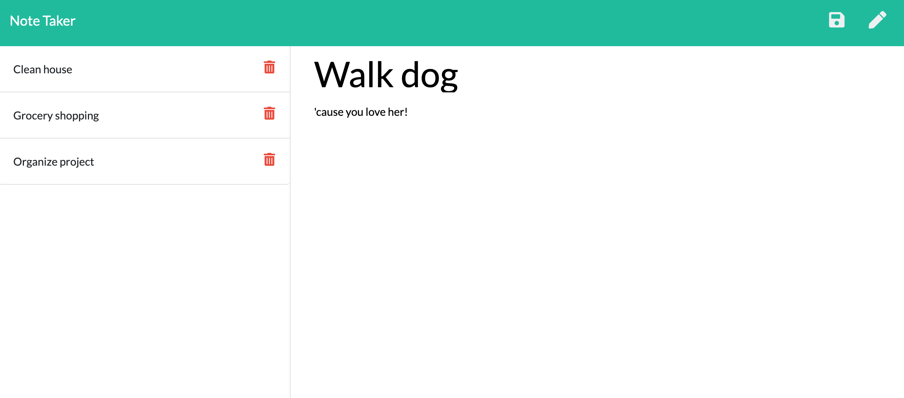

  # note-taker
  

  ## Table of Contents

  * [Installation](#installation)
  * [Technologies](#technologies)
  * [Link](#link)
  * [License](#license)
 

  ## Description
  This is a simple note-taker application that lets you store ideas and tasks in a list that is then stored to a server and recalled upon reloading. 

  Click the pencil button in the top right corner to begin writing a new note, use save button next to it when you're done. Click the red trash can icons beside the written notes on the left to delete them.

   

  ## Technologies
  * html, CSS, JavaScript
  * node, express.js, uuid.js
  * hosted on heroku
  
  ## License
  Licensed under the MIT license

  ## Link
   [note-taker](https://note-taker-itsclairehi.herokuapp.com/)

  ## Questions? 
  [my github](https://www.github.com/itsclairehi)

